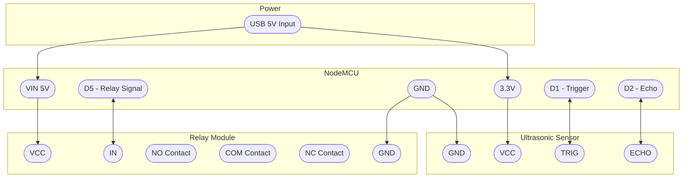

## Connections overview

```mermaid
graph TD

subgraph Power
    USB_Power([USB 5V Input])
end

subgraph NodeMCU
    VIN([VIN 5V])
    V33([3.3V])
    D1([D1 - Trigger])
    D2([D2 - Echo])
    D5([D5 - Relay Signal])
    GND([GND])
end

subgraph Ultrasonic Sensor
    USGND([GND])
    USVCC([VCC])
    TRIG([TRIG])
    ECHO([ECHO])
end

subgraph Relay Module
    RVCC([VCC])
    RIN([IN])
    NO([NO Contact])
    COM([COM Contact])
    NC([NC Contact])
    RGND([GND])
end

%% Connections

USB_Power --> VIN
USB_Power --> V33
GND --> USGND
GND --> RGND

V33 --> USVCC
VIN --> RVCC

D1 <--> TRIG
D2 <--> ECHO
D5 <--> RIN
```
